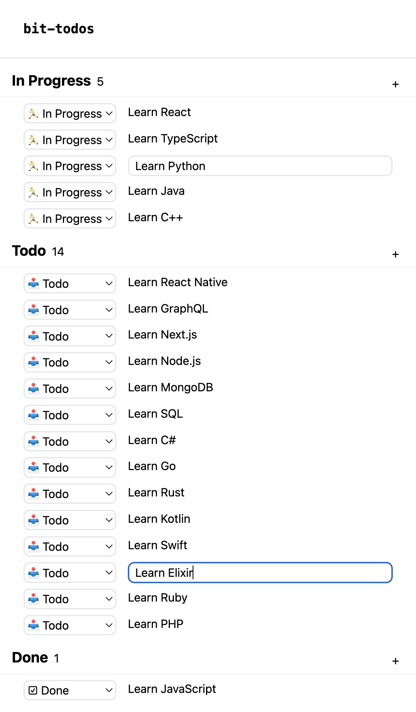
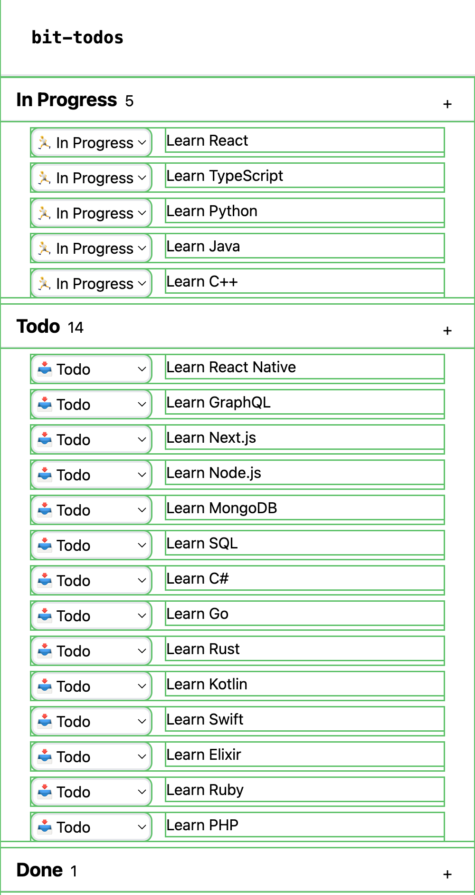

# Module: React 

# 1. Warming up

---

## 1.1 Introductie

### 1 Omschrijving

React is een open-source framework die ontwikkeld is door Facebook en de open-source community. Dit framework is uitgebracht in mei 2013.

Veel populaire bedrijven werken met dit framework. Denk aan:

- Facebook
- Instagram
- Airbnb
- Netflix
- Reddit
- Uber


> **Note**
> The original React lesson mentions a bit about React's license [that is no longer true](https://www.codemag.com/article/1701041/Legal-Notes-What%E2%80%99s-the-Deal-with-ReactJS%E2%80%99s-Licensing-Scheme). React is released under an MIT license.


#### 1.1 Kracht in components 
De kracht van React zit hem in components. Components zijn JavaScript functies die HTML[^1] returnen. Je kan een component zien als een bouwsteen waarmee je complete, dynamische web applicaties kunt bouwen.

```jsx

function MyButton() {
  return (
    <button>Ik ben een knopje</button>
  );
}
```

React stelt je in staat om eenvoudig allemaal kleine bouwstenen te maken en deze aan elkaar te knopen. Elke bouwsteen kan je meerdere keren hergebruiken.

```jsx
export default function MyApp() {
  return (
    <div>
      <h1>Welcome to my app</h1>
      <MyButton />
    </div>
  );
}
```

Elke bouwsteen (of "component") houdt zijn eigen staat bij en kan daardoor los van andere componenten functioneren. Verandert er iets in de staat van een component? Dan wordt dat component opnieuw naar je DOM gerenderd. React zorgt hier automatisch voor!

[^1]: Technisch gezien, returnen ze "JSX". Daar leer je meer over in de komende exercises.

#### 1.2 Kracht in Flexibiliteit

Vergeleken met een framework zoals Angular is React vrij miniem. Het bestaat uit een envoudig idee (functies die je UI genereren), met een kleine set aan primitives (voornamelijk "hooks"). 

Dat betekent dat het best makkelijk is om mee te beginnen en dat de gemeenschap veel vrijheid heeft om zelf oplossingen voor problemen zoals routing, internationalization, en formulieren. 

Het betekent ook dat React buiten de web kan toepassen bijvoorbeeld op [mobiele apparaten met React-Native](https://reactnative.dev/). Met React Native gebruik je dezelfde syntax als op de web, alleen zijn de basis component niet HTML element zoals `div`, `ul` en `p`, maar mobiele elementen zoals `View`, `FlatList`, en `Text`. 

#### 1.3 Kracht in Community
Een laatste voordeel van React is de gemeenschap. React heeft (samen met Vue) rondom de 200k stars op Github (vergeleken met 80k van Angular en 60k van Svelte) en het is [de populairste (client-side) framework](https://survey.stackoverflow.co/2022/#section-most-popular-technologies-web-frameworks-and-technologies).

Het is ook (in tegenstelling tot Angular) één van de [meest geliefde frameworks](https://survey.stackoverflow.co/2022/#web-frameworks-and-technologies). Met goede reden, React is een super krachtige basis om interactieve applicaties te bouwen.
 
#### 1.4 Documentatie

De [nieuwe React documentatie](https://beta.reactjs.org/) is wat van de beste documentatie op het internet. 
Noteer dat deze nieuwe documentatie nog in een betafase is. Dat betekent dat het nog niet compleet is. Als je daar niet de juiste informatie kunt vinden, zoek dan op de [originele documentatie](https://reactjs.org). (Dit zal ergens in het komende jaar geüpdatet worden.)

Let dus goed op dat je de juiste versie van de documentatie leest. React is de afgelopen jaren rigoureus veranderd (van daar de behoefte aan nieuwe documentatie). Als je hierdoor de verkeerde versie van de documentatie leest (van versies voor 16.8), dan kan je zomaar het verkeerde bouwen!

#### Leerdoelen
Op hoofdlijnen leren wat React is

#### Nieuwe Technieken

React // TODO: Copy-paste

#### Video 


---

## 1.1. Understanding the project structure
### 1. Omschrijving

> Je zult beginnen met deze [template](https://github.com/jqhoogland/react-todos/tree/6cb2324e639819b2d6c1a95cd55071eb085a41e3).

```sh
├── src
│   ├── App.tsx # Contains the top-level component
│   ├── index.css # Styling for the app
│   ├── main.tsx  # Inserts <App /> into the <div id="root"/> on index.html
│   └── vite-env.d.ts
├── index.html  # What gets returned by the server
├── package.json
├── package-lock.json
└── vite.config.ts
```

> Vraag: zijn ze nu al bekend met package.json / node_modules / js package management? 
> Zo niet moet er hier nog een stukje over die bestanden komen.

Je zult twee bestanden zien die met "vite" beginnen. [Vite](https://vitejs.dev/) is een handige library die het makkelijker maakt om frontend te ontwikkelen (via tools zoals HMR en snellere start speeds).

### 1.2 Nu jij

Tijd om te oefenen met het React project structuur. 
- Verander de `<title>` van de site naar "Bit Academy"
- Verander de text die op de pagina wordt getoont naar een `<h1>` van "Hello world" naar "Bit Academy Todos".

### 2. Leerdoelen
- Het leren navigeren in een (nieuw) React project.
### 3. Verwachte uitkomst
- De titel leest "Bit Academy" (in de navigatie balk en op de pagina als `h1`)

### 5. Nakijkcriteria

### Voorbeeld uitwerking

```jsx
// index.html
<!DOCTYPE html>
<html lang="en">
  <head>
    <meta charset="UTF-8" />
    <meta name="viewport" content="width=device-width, initial-scale=1.0" />
    <title>Bit Academy</title>
  </head>
  <body>
    <div id="root"></div>
    <script type="module" src="/src/main.tsx"></script>
  </body>
</html>

// App.jsx
export default function App() {
  return (
    <main>
      <h1>Bit Academy</h1>
    </main>
  )
}

```

### Blast

// TODO

--- 

## 1.2 Je eerste component
### 1. Omschrijving

We gaan beginnen met het basis voorbeeld voor elke JS framework — een counter!
Een counter is een component die telt hoe vaak je een knopje hebt ingedrukt.

[Lees de documentatie](https://beta.reactjs.org/learn/your-first-component)

### 2. Leerdoelen
- Leer een component definiëren.
- Leer een component te exporteren/importeren.

// TODO: VGM is dit een te grote stap. Misschien kunnen we een deel van de content al van te voren leveren.

### 3. Verwachte uitkomst
- Een bestand `src/components/Counter.jsx` met een default export `<Counter>`.
    - Dit bestaat uit een konpje en een cijfer die opteld iedere keer dat de counter wordt ingedrukt.
- Twee counter componenten onder `<App/>` die onafhankelijk van elkaar optellen als je . 
### 5. Nakijkcriteria
// TODO?
### Voorbeeld uitwerking

```jsx
// Counter.jsx
function Counter() {
    const [clicked, setClicked] = useState(0);

    return (
        <div>
            <p>I've been clicked {clicked} times.<p>
            <button onClick={() => setState(clicked + 1)}>Click me</button>
        </div>
    )
}

export default Counter;

// App.jsx
import Counter from "./components/Counter";

function App() {
    return (
        <main>
            <Counter />
            <Counter />
        </main>
    )
}

```

### Blast


---
## 1.3 JSX en HTML

### 1. Omschrijving

React components zijn functies die HTML returnen... of niet? 

In de werkelijkheid return React componenten **JSX**, een markup taal die erg geïnspireerd is door HTML maar niet precies hetzelfde is als HTML. 

Dit heb je al in de vorige exercise gezien met de button. Merk dat er in dit voorbeeld al drie belangrijke verschillen zijn.

```jsx
// jsx
<button onClick={() => setClicked(clicked + 1)}>My button</button>

// html
<button onclick="setClicked(clicked + 1)">My button</button>

```

In deze exercise leer je de [belangrijkste verschillen tussen JSX en HTML](https://beta.reactjs.org/learn/writing-markup-with-jsx).

Je product owner heeft bedacht dat zij toch geen counter app wilt bouwen maar een todo app. Dus hebben we alvast de Counter app geschrapt en een nieuwe `<Todos/>` component gedefiniërd. Alleen — is deze component nog leeg. 

Gelukkig heeft je designer je al een mockup gestuurd in html. Dus het enige wat nog overblijft is om het te converteren naar de juiste JSX.

```html

<section class="todo-section">
    <header>
        <h1>My Todo List</h1>
        <br>
        This is a simple todo list.
    </header>

    <ul class="todo-list">
        <li class="todo-item">Todo item 1</li>
        <li class="todo-item">Todo item 2</li>
        <li class="todo-item">Todo item 3</li>
    </ul>
    <hr>
    <footer style="padding-top: 10px;">
        <button>Add todo item</button>
    </footer>
</section>
```

### 2. Leerdoelen
- Leer de verschillen tussen HTML & JSX: 
    - `className` over `class`
    - `style` is an object (not a string). 
    - `{}` for attributes rather than `""`.
    - `camelCase` over `kebab-case` for attributes

### 4. Verwachte uitkomst

// TODO

### 5. Nakijkcriteria

- Self-closing loops
- Camelcase attributes (`className` > `class`)
- Curly brace-wrapped attributes

### Voorbeeld uitwerking

```jsx
function Todos() {
    return (
        <section className="todo-section">
            <header>
                <h1>My Todo List</h1>
                <br />
                This is a simple todo list.
            </header>

            <ul class="todo-list">
                <li className="todo-item">Todo item 1</li>
                <li className="todo-item">Todo item 2</li>
                <li className="todo-item">Todo item 3</li>
            </ul>
            <hr />
            <footer style={{paddingTop: "10px"}}>
                <button>Add todo item</button>
            </footer>
        </section>
    )
}

```
### Blast

// TODO

---

## 1.4 Rendering Lists
### 1. Omschrijving

"Oké," zegt je product owner, "maar waarom werkt dat knopje niet? Het zou toch nieuwe items moeten toevoegen."J

Ja, ze heeft een punt. Dus wordt het tijd om het knopje te koppelen aan de lijst van elementen. Gelukkig heb je net [de documentatie](https://beta.reactjs.org/learn/rendering-lists) hierover gelezen en kan je weer verder.

En kijk, je team member heeft al een hook geschreven waarmee je de state van de lijst kan behandelen.

// TODO: Moet hiervoor een tussenstap komen? Om de `useState` beter op te kunnen bouwen?

```jsx
function Todos() {
    const [todos, setTodos] = useState(["Todo item 1", "Todo item 2", "Todo item 3"]);

    return (
        <section className="todo-section">
            <header>
                <h1>My Todo List</h1>
                <br />
                This is a simple todo list.
            </header>

            <ul class="todo-list">
                {/* TODO */}
            </ul>
            <hr />
            <footer style={{paddingTop: "10px"}}>
                <button>Add todo item</button>
            </footer>
        </section>
    )
}

```

- Gebruik `map` om de lijst van `todos` in de `ul` te renderen. Vergeet niet een `key` te gebruiken.
- Voeg een `onClick` attribute toe aan `button` die en nieuwe todo item toevoegdt aan je lijst met de waarde `Todo item <i>`, waar `i` de positie is van die element in je lijst (plus 1). 

Handige tip:
- Gebruik de [spread operator](https://developer.mozilla.org/en-US/docs/Web/JavaScript/Reference/Operators/Spread_syntax) om snel een nieuwe lijst te definiëren.

### 2. Leerdoelen
- Leer hoe je een lijst met JSX en React kan renderen.

### 3. Technieken
- `key` prop in lijsten.
- curly braces to escape JS in JSX
- gebruik van `map` om lijsten te tonen.
- spread operator

### 4. Verwachte uitkomst
- Als je op de knop drukt, onstaat er een nieuwe element in de lijst met waarde `Todo item #` waar `#` de positie is in de lijst.
### 5. Nakijkcriteria

// TODO

### Voorbeeld uitwerking


```jsx
function Todos() {
    const [todos, setTodos] = useState(["Todo item 1", "Todo item 2", "Todo item 3"]);
    const addItem = () => setTodos([...todos, `Todo item ${todos.length + 1}`]);

    return (
        <section className="todo-section">
            <header>
                <h1>My Todo List</h1>
                <br />
                This is a simple todo list.
            </header>

            <ul class="todo-list">
                {todos.map((todo, i) => <li key={i}>{todo}</li>)}
            </ul>
            <hr />
            <footer style={{paddingTop: "10px"}}>
                <button onClick={addItem}>Add todo item</button>
            </footer>
        </section>
    )
}
```

### Blast

// TODO

---

## 1.5 Passing Props

### 1. Omschrijving
Nu heb je een todo-list waar je alleen todo items aan kunt toevoegen. Je moet natuurlijk ook de todos kunnen afvinken anders bouwen de todos eindeloos op een krijg je gegarandeerd burnout.

Laten we hiervoor een custom `<TaskListItem/>` component schrijven met een checkbox die afgevinkt kan worden.
Dit zal eisen dat we een functie `onDelete` doorgeven van de parent component, `<Todos/>`, die geroepen wordt als de gebruiker de checkbox afvinkt.

[Lees verder](https://beta.reactjs.org/learn/passing-props-to-a-component)

Handige tip: Gebruik `slice` in combinatie met de spread operator `...` om een item van een lijst te verwijderen.

### 2. Leerdoelen
- Leer hoe je props door kan geven aan child components, & hoe object destructuring werkt.
- Leer hoe de `children` prop werkt
### 3. Technieken

### 4. Verwachte uitkomst

### 5. Nakijkcriteria

### Voorbeeld uitwerking


```jsx
function TodoListItem({onDelete, children}) {
    return (
        <li>
            <input type="checkbox" onClick={onDelete}>
            <span>{children}</span>
        </li>
    )
}

function Todos() {
    const [todos, setTodos] = useState(["Todo item 1", "Todo item 2", "Todo item 3"]);
    const addItem = () => setTodos([...todos, `Todo item ${todos.length + 1}`]);
    const removeItem = (i) => setTodos([...todos.slice(0, i), ...todos.slice(i + 1)])

    return (
        <section className="todo-section">
            <header>
                <h1>My Todo List</h1>
                <br />
                This is a simple todo list.
            </header>

            <ul class="todo-list">
                {todos.map((todo, i) => (
                    <TodoListItem key={i} onDelete={() => removeItem(i)}>
                        {todo}
                    </TodoListItem>
                ))}
            </ul>
            <hr />
            <footer style={{paddingTop: "10px"}}>
                <button onClick={addItem}>Add todo item</button>
            </footer>
        </section>
    )
}
```

### Blast


---

## 1.6 Conditional Rendering


### 1. Omschrijving
"Maar wat als een gebruiker geen todo's meer over heeft?" vraagt je PO. 
"Moeten ze niet een beloning krijgen dat ze alles af hebben?"

Klinkt als een plan. Laten we de gebruiker een speciaal bericht laten zien ("Gefeliciteerd, je hebt geen todo's!") maar alleen als diegene geen todo's meer heeft.

[Lees verder](https://beta.reactjs.org/learn/conditional-rendering)

### 2. Leerdoelen
- Leer conditional rendering. Met `if` of `&&`
### 3. Technieken

### 4. Verwachte uitkomst

### 5. Nakijkcriteria

### Voorbeeld uitwerking


```jsx
function Todos() {
    const [todos, setTodos] = useState(["Todo item 1", "Todo item 2", "Todo item 3"]);
    const addItem = () => setTodos([...todos, `Todo item ${todos.length + 1}`]);
    const removeItem = (i) => setTodos([...todos.slice(0, i), ...todos.slice(i + 1)])

    return (
        <section className="todo-section">
            <header>
                <h1>My Todo List</h1>
                <br />
                This is a simple todo list.
            </header>

            <ul class="todo-list">
                {todos.map((todo, i) => (
                    <TodoListItem key={i} onDelete={() => removeItem(i)}>
                        {todo}
                    </TodoListItem>
                ))}
                {todos.length === 0 && "Gefeliciteerd, je hebt geen todo's!"}
            </ul>
            <hr />
            <footer style={{paddingTop: "10px"}}>
                <button onClick={addItem}>Add todo item</button>
            </footer>
        </section>
    )
}

// OF // TODO: Hoe kunnen we beide methodes testen?

function TodoList({todos, removeItem}) {
    if (todos.length === 0) {
        return null
    }
    
    return (
        <ul class="todo-list">
            {todos.map((todo, i) => (
                <TodoListItem key={i} onDelete={() => removeItem(i)}>
                    {todo}
                </TodoListItem>
            ))}
        </ul>
    )
}

```

### Blast
// TODO

---

## 1.6 Put it all together
### 1. Omschrijving
Met een laatste feature, hebben we de MVP... todos die je kunt editen.


### 2. Leerdoelen
- Leer hoe je met inputs moet omgaan in React.
- Leer over React's Synthetic Events (`e.target.value`).
- Oefen met prop passing
### 3. Technieken

### 4. Verwachte uitkomst

### 5. Nakijkcriteria
- Nieuwe functie `editItem` gedefinieerd op `<Todos />`, die een index neemt en een 

### Voorbeeld uitwerking

```jsx


function TodoListItem({onDelete, onEdit, children}) {
    return (
        <li>
            <input type="checkbox" onClick={onDelete}>
            <input value={children} onChange={(e) => onEdit(e.target.value)}/>
        </li>
    )
}

function Todos() {
    const [todos, setTodos] = useState(["Todo item 1", "Todo item 2", "Todo item 3"]);
    const addItem = () => setTodos([...todos, `Todo item ${todos.length + 1}`]);
    const removeItem = (i) => setTodos([...todos.slice(0, i), ...todos.slice(i + 1)]);
    const editItem = (i, value) => setTodos([...todos.slice(0, i), value, ...todos.slice(i + 1)]);

    return (
        <section className="todo-section">
            <header>
                <h1>My Todo List</h1>
                <br />
                This is a simple todo list.
            </header>

            <ul class="todo-list">
                {todos.map((todo, i) => (
                    <TodoListItem key={i} onDelete={() => removeItem(i)} onEdit={(value) => editItem(i, value)}>
                        {todo}
                    </TodoListItem>
                ))}
                {todos.length === 0 && "Gefeliciteerd, je hebt geen todo's!"}
            </ul>
            <hr />
            <footer style={{paddingTop: "10px"}}>
                <button onClick={addItem}>Add todo item</button>
            </footer>
        </section>
    )
}
```

### Blast
// TODO

---

## 1.7 Imperative en Declarative UI; Virtual DOMS — Checkpoint/quiz?

React was aan het begin heel erg geinspireerd door Angular.

Beide Angular en React zijn ontstaan als een reactie op JQuery. In "the old days"[^1], was Javascript een nachtmerrie.

Toendertijd was de enige manier om via Javascript toegang te krijgen aan de DOM (de boom van HTML elementen), door `getElemenyById`. 

```html
<html>

    <div id="my-div">
        Hello world
    </div>

    <button id="my-button">
        My Button
    <button>

    <script>

        document.getElementById('my-button').addEventListener('click', function () {
            document.getElementById('my-div').classList.toggle('red') // Check toggleClass
        })

    </script>
</html>

```

Dat is heel veel code om alleen de class van een component te veranderen aan de hand van een button click. Het wordt alleen erger naarmate de functionaliteit ingewikkelder wordt. 

```html
<script>

$('#my-button').on('click', function() {
    $('#my-div').toggleClass('red')
})

</script>
```

Veel compacter! 

Waar het probleem onstaat is bij grotere applicaties. Die veel requests naar de server sturen en terugkrijgen. 

Met een imperative aanpak, vertel je de DOM wat er moet gebeuren (imperatief van het latijn voor bevel). Met JQuery (en vanilla Javascript) vertel je een element om de classe `red` te switchen.

Het probleem hier is dat je `state` en `UI` per ongeluk uit elkaar kunnen lopen.
// TODO: bendenk voorbeeld.
Wat er vaak in de praktijk gebeurden is dat mensen hele elementen opnieuw zouden creëren iedere keer dat de data updatete. 
Dit is niet ideaal want het kan intensief zijn om elementen te renderen, vooral als je dat vaak moet doen.

React is een "functionele" oplossing op dit probleem. Door je components als functies te definieren is het idee dat de zelfde data altijd dezelfde outputs genereert. Dit betekent dat je nasty edge cases van JQuery kunt voorkomen. 

Om te zorgen dat dit efficient kan plaats vinden (zonder al te veel renders), maakt React gebruik van een "virtuele DOM". Dit is een kopie van de echte DOM wat alleen binnen React bestaat. Als je component update, dan maakt het veranderingen aan de virutele DOM en niet de echte DOM omdat deze veranderingen veel "goedkoper" zijn dan verandering aan de echte DOM. React bepaalt dan door de virtuele DOM te vergelijken met vorige versies van zichzelf of het de echte DOM moet veranderen. 

[^1]: Het is nog steeds een nachtmerrie, maar het was toen nog erger.

// TODO: ADD questions

---

# 2 Denken in React
## 2.1 Break apart the component hierarchy

### 1. Omschrijving

// TODO: Schrijf iets over [Thinking in React](https://beta.reactjs.org/learn/thinking-in-react)

> **Copy-paste**: De exercise [2.2 Structuur](https://ams.jarvis.bit-academy.nl/a/code/editor/modules/fc2d4ab4-eeac-11eb-978a-4213e7ee7fac/levels/5e8285e7-67c9-11ec-9431-4213e7ee7fac/exercises/50944467-2365-4144-bb36-2f4290f95957/editor)

Given this mockup, break this down into components.


> **Challenge**: Wat van [de final version](https://bit-todos.vercel.app/)?

### 2. Leerdoelen
- Het leren denken in componenten.
- De [5 stappen van React](https://beta.reactjs.org/learn/thinking-in-react) leren. 

### 3. Technieken

### 4. Verwachte uitkomst

### 5. Nakijkcriteria
- 

### Voorbeeld uitwerking

Goals:
 It depends how you want to break it down, but you can get something like: `<Layout/>`, `<NavBar/>`, `<TodoSection/>`, `<TodoSectionHeader/>`, `<TodoSectionBody/>`, `<TodoItem/>` 

## 2.2 Build a static version

NOTE: Hier beginnen we met een verse repo die alvast tailwind geïnstalleerd heeft.
### 1. Omschrijving

NOTE: You are free to skip prop drilling for now (thereby breaking the status select & text input)

### 2. Leerdoelen
- 
### 3. Technieken

### 4. Verwachte uitkomst


### 5. Nakijkcriteria
- [x] Get [Tailwind up and running](https://tailwindcss.com/docs/guides/vite).
- [x] Split out the layouts (`<NavBar/>`, `<Layout/>`, & `<Header/>`)

### Voorbeeld uitwerking

[Zie hier](https://github.com/jqhoogland/react-todos/tree/2/2-build-a-static-version)

- [x] Convert checkbox -> status select && split the todo list item into:
    - [x] A span that turns into a text input on click (`<ToggleableInput/>`). (This is what the current list item is).
    - [x] A status select (to replace the checkbox).
    - [x] A wrapper for the two of these.

```ts
export const statuses = [
  { label: 'In Review', value: "in_review", icon: "🙇" },
  { label: 'In Progress', value: "in_progress", icon: "🏃" },
  { label: 'Todo', value: "todo", icon: "📥" },
  { label: 'Done', value: "done", icon: "☑️" },
  { label: 'Canceled', value: "canceled", icon: "🗑" }
];
```

- Then change the top level component from a todos & completed list to a separate list for each status.

Goals:
- Learn how to break apart files into a semisensible structure. (Atomic components is overkill and bad.)
    - https://www.joshwcomeau.com/react/file-structure/
    - https://www.youtube.com/watch?v=86i8ZODqMlI


## 2.3 Find the minimal but complete representation of UI state

### 1. Omschrijving


(Mostly thoughtwork)

What is state and what isn't? (This question is always relative to a given component)
- The status inside the status select component? Nope. We want it to be passed down all the way from the top-level Tasks component.
- The text of the todo component inside the text input? Maybe, it depends. 
    - This can be "controlled" by the top-level Tasks component.
    - But you may not want it to "submit" until the user hits enter to confirm. That way they could hit "escape" to revert to the original state. In this case, you would need local state during editing. (actually you could get away with an uncontrolled component but that comes later)
- Whether the todo component is editable (and displaying an input) or not (and displaying a span). Yes. This exists locally on each component.
- The list of todo items inside the status-specific todo list? Nope. This is passed down from one higher component, a <Tasks/> component whose state contains all of the todos.
    - This is because we want to be able to change todos between different lists by selecting a new status. It wouldn't be possible if the state was restricted to a specific status.

// TODO: Is dit een quiz ipv exercise? 

### 2. Leerdoelen
- 
### 3. Technieken

### 4. Verwachte uitkomst

### 5. Nakijkcriteria

### Voorbeeld uitwerking
[Zie hier](https://github.com/jqhoogland/react-todos/tree/2/3-determine-UI-state)


## 2.4 Identify where state should live.
### 1. Omschrijving

We've actually already mostly done this. We want the state to live in the `<Tasks/>` component.
- [x] Let's pass state all the way down from the top-level to the bottom.

Another relatively easy step. 
NOTE: 2.2 is quite a lot of work in comparison to these two — maybe we can split more of this out or introduce a little more state (e.g., a button to collapse a section)?

### 2. Leerdoelen
- "Lifting state up"
### 3. Technieken

### 4. Verwachte uitkomst

### 5. Nakijkcriteria

### Voorbeeld uitwerking
[Zie hier](https://github.com/jqhoogland/react-todos/tree/2/4-identify-where-state-should-live)

## 2.5 Add inverse data flow

### 1. Omschrijving

### 2. Leerdoelen
- 
### 3. Technieken

### 4. Verwachte uitkomst


### 5. Nakijkcriteria
- [x] When you select a new status, it should propagate up (and change in all other lists)
- [x] When you change a test
- [x] When you add a new todo, it should have the status of the group you added it from.
- [x] Todos should be filtered by status

### Voorbeeld uitwerking
[Zie hier](https://github.com/jqhoogland/react-todos/tree/2/4-identify-where-state-should-live)

---

# 3. All about hooks
## 3.1 `useContext` & Dark Mode 

### 1. Omschrijving

- [x] Add a checkbox to the right of the navbar for enabling dark mode. Also add DaisyUI because it makes themes a little easier (all you have to do is replace `bg-white` with `bg-base-100`).
   - This involves changing attributes on `<html/>` so a diagram will be helpful. (This previews what we're about to do with state).
- [x] Let's add a footer that displays a moon or sun emoji depending on the theme. We have to lift state up to `<Layout/>`. Oof. Also, changing the DOM directly is not very React, so there's a good "theoretical" reason to do this!
- [x] Extract the state to a `<ThemeProvider/>` and remove prop-drilling in favor of context.
    - Show that this gets a little easier with prop spreading.
    - To show how much nicer this is, put a `<ThemeToggle/>` inside each of the todo items. Doing this with drilling would have meant raising the state to `<App/>`, then passing it down all the way. No thanks.
- [x] Make it look a little prettier. Take advantage of Daisyui's component-style classes (`.btn` for the add button, `.input` for the toggleable input, `.select` for the select, `.bg-base-[100,200,300]`, `.border-base-[100,200,300]`, and `.toggle` for the switch. Also useful are modifiers `.[btn,input,select,...]-[xs,sm,...]`, and `.[btn,input,...]-bordered`).

Goals:
- Actually learn the word "prop-drilling". Are you exhausted yet having to repeatedly type the same props you pass down again and again? It gets easy with the spread operator, but it's still annoying!
- Understand `useContext`, `Providers`
- Introduction to the render cycle. 
- When to use `useContext` and when not to use `useContext` (most of the time). Alternatives (smart use of children).


### 2. Leerdoelen
### 3. Technieken

### 4. Verwachte uitkomst

### 5. Nakijkcriteria

### Voorbeeld uitwerking


```jsx
```

### Blast
// TODO

---
## 3.2 `useRef` to autofocus & animate

- [x] When we click the toggleable input to open the text input, we want it to autofocus. Right now, we have to click twice. That's frustrating and annoying!
   - In order to focus, we need to access the actual DOM element. You see... [introduce the "virtual dom"].
   - Also introduce the render cycle because we'll need `flushSync` (because the element isn't rendered immediately!)
- [x] Introduce [auto-animate](https://auto-animate.formkit.com/) for another example of `useRef` (& light introduction of `useEffect`)


### 1. Omschrijving

### 2. Leerdoelen
- 
### 3. Technieken

### 4. Verwachte uitkomst

### 5. Nakijkcriteria

### Voorbeeld uitwerking


```jsx
```

### Blast
// TODO

---
## 3.3 `useEffect` to autofocus better

- [x] When you create a new element, it shows up non-toggled. Ideally, we'd like to create a new element, and automatically open & focus the input & slide it into view.
- [x] We want to persist the state of our theme, so that it's the same after the page reloads.
- [x] We want to avoid FOUC (flash of unstyle content) so we use `useLayoutEffect` instead.
- [x] We want to persist the todos to local storage as well. Let's start by writing out the code inside the `<Tasks/>` element.

- A small theoretical section on `useEffect`:
  - A major note of caution: `useEffect` should be used as a last resort. Side-effects belong in event handlers not as a consequence of special renders.


```tsx
function loadDarkMode() {
    const theme = localStorage.getItem('theme')
    document.documentElement.setAttribute('data-theme', theme ?? 'light')
    return theme === 'dark'
}

export function ThemeProvider({ children }: PropsWithChildren) {
    const [isDarkMode, setIsDarkMode] = useState(loadDarkMode);
    
    // ...
}
```

would be more appropriate than doing the same inside a `useLayoutEffect`.

### 1. Omschrijving

### 2. Leerdoelen
- 
### 3. Technieken

### 4. Verwachte uitkomst

### 5. Nakijkcriteria

### Voorbeeld uitwerking


```jsx
```

### Blast
// TODO

---
## 3.4 `useCustomEffect` to persist state in multiple places & explain ourselves better
- [x] First of all, let's take advantage of `autoFocus` to get rid of some excess code. 
- [x] And let's use `auto-animate`'s custom hook to simplify that code. Lightweight example that introduces the idea of custom hooks without having to write a custom hook yourself.
- [x] Let's start by extracting a `useTheme = () => useContext(ThemeContext)` hook. (Out of order)
- [x] Now let's extract the `<Tasks/>` logic into its own hook. For now, this serves to make it more legible.
- [x] In light of the single responsibility principle, can we extract the specific function of `useState` + local storage? 
- [x] What about the list-methods that we need in todos. We're likely to need those in the future.
    - In hindsight this is probably too difficult, and it's not obvious what the value is. First, introduce users and why we need this.


### 1. Omschrijving

### 2. Leerdoelen
- 
### 3. Technieken

### 4. Verwachte uitkomst

### 5. Nakijkcriteria

### Voorbeeld uitwerking


```jsx
```

### Blast
// TODO

---


## 3.5 React in Context

React is bekend voor minimaliteit. 

Vergelijk [Angular](https://angular.io/), de historische "vijand" van React ontworpen door Google. Angular komt met "batteries included" — de core product heeft al oplossing bedacht voor veel voorkomende problemen zoals routing, forms, internationalization ("i18n") en meer. 

Bij React, worden deze oplossingen overgelaten aan de community. 
- Voor routing moet je kiezen tussen bijvoorbeeld [Remix/react-router](https://github.com/remix-run/react-router) en [Next.js](https://nextjs.org/).
- Voor formulieren, [react hook form](https://react-hook-form.com/) of [formik](https://github.com/jaredpalmer/formik) of misschien vanilla. 
- Voor i18n, [react-i18next](https://react.i18next.com/) of [React-intl](https://github.com/formatjs/formatjs) of [next-intl](https://github.com/amannn/next-intl/tree/main/packages/next-intl/src)...
- Voor data-fetching, [react-query](https://react-query.tanstack.com/) of [swr](https://swr.vercel.app/) (of weer Remix). 

Dan moet je nog een component library kiezen, authenticatie bedenken, misschien een state management library, en zo voort. 

Dit kan voor een beginner (en zelfs een gevorderde React developer) overweldigend zijn. Maar het heeft voordelen. Dankzij het feit dat React klein blijft, heeft de community meer vrijheid om te besluiten wat de beste manier is om naar vore te gaan.

Bijvoorbeeld, in 2019, is React overgestapt van [class-based components naar functional components](https://reactjs.org/blog/2019/02/06/react-v16.8.0.html). Dit is een belangrijke stap geweest wat vaak naar veel heldere code heeft geleid. 

Zier hier een voorbeeld van een component wat een verbinding met een chatroom heeft. Deze verbinden moet aangemaakt worden als de component voor het eerst is gerendered, maar het moet ook afgebroken worden als de component verwijderd wordt (omdat je naar een nieuwe pagina gaat).

Met class-based components, worde deze faze van de "lifecycle" gesplits.

```jsx

class MyChatRoom {
    // Runs the first time the component is rendered (on "mount")
    componentDidMount() {
        chatroom.connect()
    }

    // Runs before the component is unrendered (on "unmount")
    componentWillUnmount() {    
        chatroom.disconnect()
    }

    render() {
        return <div>...</div>
    }
}

```

Met functional components schrijf je een "hook":


```jsx
function MyChatRoom() {

    // Hooks let you bundle logic by meaning rather than lifecyle
    useEffect(() => {
        chatroot.connect()

        // De returnwaarde is een functie die gecalld wordt op "unmount"
        return () => chatroom.disconnect() 
    }, [])

    return <div>...</div>
}

```

Nog beter, je kan deze functionaliteit abstraheren, dus ook hergebruiken in andere components.

```jsx
function useChatRoom () {
    useEffect(() => {
        chatroom.connect()
        return () => chatroom.disconnect()
    })
}

function MyChatRoom() {
    useChatRoom()

    return <div>...</div>
}

```

# 4. Finishing & launching the application

## 1. Priority. 

- [x] Let's add priority. Create a `<TodoPrioritySelect/>` and wire it up inside the `<TodoListItem/>`. Get it fully working. Add the following to `data.ts`.
    - NOTE: (You may have to delete `todos` in localStorage to get everything displaying correctly)

```ts
export const priorities = [
  { label: 'Urgent', value: 5, icon: "🔥" },
  { label: 'High', value: 4, icon: "🟥" },
  { label: 'Medium', value: 3, icon: "🟧" },
  { label: 'Low', value: 2, icon: "🟨" },
  { label: "None", value: 1, icon: "⬜️" },
]
```


## 2. Users

- [x] Let's add users we can assign todos to. Create a `<TodoUserSelect/>` and wire it up inside the TodoListItem... Make sure to add a fallback in case nobody has been assigned!
```ts
export const users = [
  { id: 0, label: 'Gadisa' },
  { id: 1, label: 'Mehdi' },
  { id: 1, label: 'Henk' },
  { id: 1, label: 'Ayşe' },
]
```


## 2b. Multiple users

- [x] But what if we want multiple users? You will definitely want to delete `todos` from localStorage (and include `assigned: []` in your new list of defaults )


## 3. Let's make it pretty

- Make a `<Dropdown/>` component (on top of [this](https://daisyui.com/components/dropdown/)) to free up some space in the todo list. Put the multiselect inside of it and display a button of initial avatars instead.
- Can you make it look like what you see in the video?

Tip: 
- If you want the dropdown on the right to align correctly, you'll have to pass it the `.dropdown-end` class. How to do this with nested components? Check out the library `clsx`.

```jsx

const myComponent = <MyCustomComponent className="my-classname"/>;

function MyCustomComponent({className}) {
    return <div className={"base-class " + className} />
    // OR
    return <div className={["base-class", className].join(" ")} />
    // OR
    return <div className={clsx("base-class", className)} />  // This is great if, for example, `className=undefined` or `null`.
}

```
Bonus points for avatar items (but this isn't required).


### 1. Omschrijving

### 2. Leerdoelen
- 
### 3. Technieken

### 4. Verwachte uitkomst

### 5. Nakijkcriteria

### Voorbeeld uitwerking


```jsx
```

### Blast
// TODO

---


### XXX? Deleting items

Add the ability to delete items if you hit delete or backspace & it's empty.
In retrospect this fits more appropriately with the custom `useTodos` hooks.


## 4. Adding routing

- [x] Clean up the file structure a little
- [x] Install react-router & react-router-dom. Wrap `<App/>` in `main.tsx` with `<BrowserRouter/>`. Put `<Routes>...</Routes>` in the `App.tsx`. 
- [x] Add a `<Users/>` page. Let it display a list of users (and a header with the title "Users").
- [x] Add a `useUsers` hook, based off of the `useTodos` hook. Link it to state
- [x] Link the original `<TodoAssignedSelect/>` component to useUsers

Make sure to emphasize the sense in which this is not a typical hook. It uses localStorage to synchronize state. That means it won't actually update in real time & only makes sense on different routes. 

### 1. Omschrijving

### 2. Leerdoelen
- 
### 3. Technieken

### 4. Verwachte uitkomst

### 5. Nakijkcriteria

### Voorbeeld uitwerking


```jsx
```

### Blast
// TODO

---

## 5. Adding performance — memoization

Talk about the render cycle. At what point does React decide to rerender a component. Shallow comparison versus nested comparison.


### 1. Omschrijving

### 2. Leerdoelen
- 
### 3. Technieken

### 4. Verwachte uitkomst

### 5. Nakijkcriteria

### Voorbeeld uitwerking


```jsx
```

### Blast
// TODO

---
