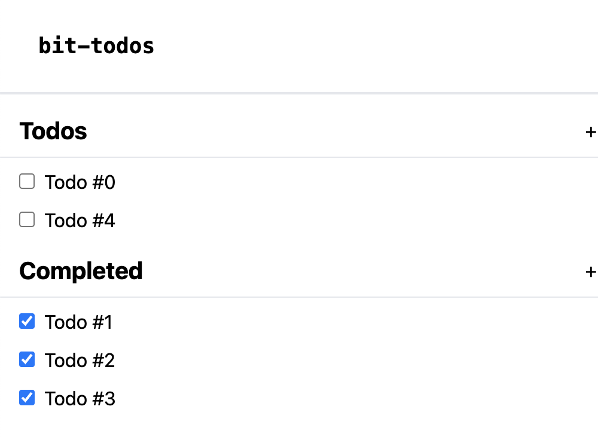

# 1. Welcome to React
## 1. Warming up

Goals:
- What is a component?
- What is JSX? How is it different from html?
    - `className` over `class`
    - `style` is an object (not a string). 
    - `{}` for attributes rather than `""`.
    - `camelCase` over `kebab-case` for attributes


## 2. Let's get reactive
> Let's make the todo items editable & deletable. Also I want several todo lists.

1. Extract a `<TodoList/>` component (with local state) & put two of them next to each other on the home page.


Goals: 
- Breaking apart components.
- "Prop-drilling" 
- "Conditional renders"


## 3. Lifting state up
> Let's make it possible to move todo items between a "todo" list and "completed list".

Goals:
- "Lifting state up" & the perils of local state


# 2. Thinking in React

## 1. Break apart the component hierarchy
> Learn the [5 steps of React](https://beta.reactjs.org/learn/thinking-in-react). (This isn't an ironclad law but still useful).

Given this mockup:


- [x] How might you break this apart? Just list some of the component names.

Goals:
- Break this down into components. It depends how you want to break it down, but you can get something like: `<Layout/>`, `<NavBar/>`, `<TodoSection/>`, `<TodoSectionHeader/>`, `<TodoSectionBody/>`, `<TodoItem/>` 


## 2. Build a static version

- [x] Get [Tailwind up and running](https://tailwindcss.com/docs/guides/vite).
- [x] Split out the layouts (`<NavBar/>`, `<Layout/>`, & `<Header/>`)




- [x] Convert checkbox -> status select && split the todo list item into:
    - [x] A span that turns into a text input on click (`<ToggleableInput/>`). (This is what the current list item is).
    - [x] A status select (to replace the checkbox).
    - [x] A wrapper for the two of these.

NOTE: You are free to skip prop drilling for now (thereby breaking the status select & text input)

```ts
export const statuses = [
  { label: 'In Review', value: "in_review", icon: "🙇" },
  { label: 'In Progress', value: "in_progress", icon: "🏃" },
  { label: 'Todo', value: "todo", icon: "📥" },
  { label: 'Done', value: "done", icon: "☑️" },
  { label: 'Canceled', value: "canceled", icon: "🗑" }
];
```

- Then change the top level component from a todos & completed list to a separate list for each status.

Goals:
- Learn how to break apart files into a semisensible structure. (Atomic components is overkill and bad.)
    - https://www.joshwcomeau.com/react/file-structure/
    - https://www.youtube.com/watch?v=86i8ZODqMlI


## 3. Find the minimal but complete representation of UI state

(Mostly thoughtwork)

What is state and what isn't? (This question is always relative to a given component)
- The status inside the status select component? Nope. We want it to be passed down all the way from the top-level Tasks component.
- The text of the todo component inside the text input? Maybe, it depends. 
    - This can be "controlled" by the top-level Tasks component.
    - But you may not want it to "submit" until the user hits enter to confirm. That way they could hit "escape" to revert to the original state. In this case, you would need local state during editing. (actually you could get away with an uncontrolled component but that comes later)
- Whether the todo component is editable (and displaying an input) or not (and displaying a span). Yes. This exists locally on each component.
- The list of todo items inside the status-specific todo list? Nope. This is passed down from one higher component, a <Tasks/> component whose state contains all of the todos.
    - This is because we want to be able to change todos between different lists by selecting a new status. It wouldn't be possible if the state was restricted to a specific status.


## 4. Identify where state should live.

We've actually already mostly done this. We want the state to live in the `<Tasks/>` component.
- [x] Let's pass state all the way down from the top-level to the bottom.

Another relatively easy step. 
NOTE: 2.2 is quite a lot of work in comparison to these two — maybe we can split more of this out or introduce a little more state (e.g., a button to collapse a section)?

## 5. Add inverse data flow

- [x] When you select a new status, it should propagate up (and change in all other lists)
- [x] When you change a test
- [x] When you add a new todo, it should have the status of the group you added it from.
- [x] Todos should be filtered by status

# 3. All about hooks

## 1. `useContext` (and implementing a dark-mode).

- [x] Add a checkbox to the right of the navbar for enabling dark mode. Also add DaisyUI because it makes themes a little easier (all you have to do is replace `bg-white` with `bg-base-100`).
   - This involves changing attributes on `<html/>` so a diagram will be helpful. (This previews what we're about to do with state).
- [x] Let's add a footer that displays a moon or sun emoji depending on the theme. We have to lift state up to `<Layout/>`. Oof. Also, changing the DOM directly is not very React, so there's a good "theoretical" reason to do this!
- [x] Extract the state to a `<ThemeProvider/>` and remove prop-drilling in favor of context.
    - Show that this gets a little easier with prop spreading.
    - To show how much nicer this is, put a `<ThemeToggle/>` inside each of the todo items. Doing this with drilling would have meant raising the state to `<App/>`, then passing it down all the way. No thanks.
- [x] Make it look a little prettier. Take advantage of Daisyui's component-style classes (`.btn` for the add button, `.input` for the toggleable input, `.select` for the select, `.bg-base-[100,200,300]`, `.border-base-[100,200,300]`, and `.toggle` for the switch. Also useful are modifiers `.[btn,input,select,...]-[xs,sm,...]`, and `.[btn,input,...]-bordered`).

Goals:
- Actually learn the word "prop-drilling". Are you exhausted yet having to repeatedly type the same props you pass down again and again? It gets easy with the spread operator, but it's still annoying!
- Understand `useContext`, `Providers`
- Introduction to the render cycle. 
- When to use `useContext` and when not to use `useContext` (most of the time). Alternatives (smart use of children).


## 2. `useRef` to autofocus & animate

- [x] When we click the toggleable input to open the text input, we want it to autofocus. Right now, we have to click twice. That's frustrating and annoying!
   - In order to focus, we need to access the actual DOM element. You see... [introduce the "virtual dom"].
   - Also introduce the render cycle because we'll need `flushSync` (because the element isn't rendered immediately!)
- [x] Introduce [auto-animate](https://auto-animate.formkit.com/) for another example of `useRef` (& light introduction of `useEffect`)


## 3. `useEffect` to autofocus better

- [x] When you create a new element, it shows up non-toggled. Ideally, we'd like to create a new element, and automatically open & focus the input & slide it into view.
- [x] We want to persist the state of our theme, so that it's the same after the page reloads.
- [x] We want to avoid FOUC (flash of unstyle content) so we use `useLayoutEffect` instead.
- [x] We want to persist the todos to local storage as well. Let's start by writing out the code inside the `<Tasks/>` element.

- A small theoretical section on `useEffect`:
  - A major note of caution: `useEffect` should be used as a last resort. Side-effects belong in event handlers not as a consequence of special renders.


```tsx
function loadDarkMode() {
    const theme = localStorage.getItem('theme')
    document.documentElement.setAttribute('data-theme', theme ?? 'light')
    return theme === 'dark'
}

export function ThemeProvider({ children }: PropsWithChildren) {
    const [isDarkMode, setIsDarkMode] = useState(loadDarkMode);
    
    // ...
}
```

would be more appropriate than doing the same inside a `useLayoutEffect`.

## 4. `useCustomEffect` to persist state in multiple places & explain ourselves better
- [x] First of all, let's take advantage of `autoFocus` to get rid of some excess code. 
- [x] And let's use `auto-animate`'s custom hook to simplify that code. Lightweight example that introduces the idea of custom hooks without having to write a custom hook yourself.
- [x] Let's start by extracting a `useTheme = () => useContext(ThemeContext)` hook. (Out of order)
- [x] Now let's extract the `<Tasks/>` logic into its own hook. For now, this serves to make it more legible.
- [x] In light of the single responsibility principle, can we extract the specific function of `useState` + local storage? 
- [x] What about the list-methods that we need in todos. We're likely to need those in the future.
    - In hindsight this is probably too difficult, and it's not obvious what the value is. First, introduce users and why we need this.


# 4. Finishing & launching the application

## 1. Priority. 

- [x] Let's add priority. Create a `<TodoPrioritySelect/>` and wire it up inside the `<TodoListItem/>`. Get it fully working. Add the following to `data.ts`.
```ts
export const priorities = [
  { label: 'Urgent', value: 5, icon: "🔥" },
  { label: 'High', value: 4, icon: "🟥" },
  { label: 'Medium', value: 3, icon: "🟧" },
  { label: 'Low', value: 2, icon: "🟨" },
  { label: "None", value: 1, icon: "⬜️" },
]
```

